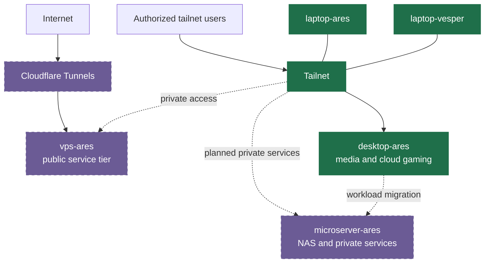

# Homelab

Personal NixOS fleet configuration and infrastructure vault for a growing set of user-owned machines. It keeps machine state, user preferences, service configuration, and encrypted operational material in one declarative repository.

The fleet favors privacy-first mobile access, user control over data, reproducible machine states, and incremental improvement. Local and FOSS-capable tools are preferred, while explicit non-FOSS options remain available when a professional workflow needs them.

## Fleet

Projects group machines by ownership and operation. Each machine has a primary operator; other users may be guests. A project name acts as a stable namespace rather than a location: project -> machines -> primary operator.

| Project | Host | Status | Role |
| --- | --- | --- | --- |
| Ares | `desktop-ares` | Current | Primary workstation for `sphoono`; also runs current private media services and home cloud gaming. |
| Ares | `laptop-ares` | Current | Secondary workstation for `sphoono`. |
| Ares | `vps-ares` | In progress | Public service tier for workflow automation and future web workloads. |
| Ares | `microserver-ares` | Planned | Optional NAS and private-services appliance, intended to take private hosting workloads from the workstation. |
| Vesper | `laptop-vesper` | Current | Laptop for `spookyskelly`. |



Solid nodes represent current fleet components. Dashed nodes and links mark in-progress or planned work.

## Access And Data Boundaries

Private services use tailnet access through Docktail. Public services use Cloudflare Tunnels through the public VPS tier. Containers should not publish direct inbound ports unless a configuration documents the exception.

This design supports use away from a home network. Operators can choose their own tailnet and VPN implementation; the configuration uses Tailscale today, but the access model does not depend on it.

The repository stores encrypted secret material through SOPS and Age. It does not document secret-unsealing procedures, service endpoints, account identifiers, physical locations, or other operational identifiers in this README.

## Configuration Layout

| Path | Purpose |
| --- | --- |
| `flake.nix` | Declares inputs, composition, and exported NixOS and Home Manager configurations. |
| `nix/systems/` | Host-specific NixOS configuration, disk layouts, hardware facts, and encrypted system secrets. |
| `nix/homes/` | User base profiles and host-specific Home Manager preferences. |
| `nix/modules/nixos/` | Reusable system modules for core services, desktop environments, hosting, and themes. |
| `nix/modules/home/` | Reusable Home Manager modules for shells, applications, desktop settings, and personal tools. |
| `nix/overlays/` | Package overlays for software that needs local packaging or customization. |
| `.sops.yaml` | Rules for encrypted secret files and recipients. |
| `actions.nix` | Source for generated GitHub Actions CI configuration. |

NixOS host configurations are the fleet's primary outputs. Standalone Home Manager configurations provide user-preference environments and receive the same CI build coverage, but they do not define the network topology.

## Validate And Build

Run these commands from the repository root. They do not activate a configuration.

```bash
nix develop
nix flake check --all-systems
```

Build a declared NixOS target:

```bash
nix build .#nixosConfigurations.desktop-ares.config.system.build.toplevel
nix build .#nixosConfigurations.laptop-ares.config.system.build.toplevel
nix build .#nixosConfigurations.laptop-vesper.config.system.build.toplevel
```

Build a standalone Home Manager target:

```bash
nix build .#homeConfigurations.sphoono.activationPackage
nix build .#homeConfigurations.spookyskelly.activationPackage
```

After validation, activate a new generation on the matching local host:

```bash
nh os switch .
```

`nh os switch .` changes the current machine. Build and validate the intended target before activation.

## Delivery

GitHub Actions evaluates the full flake and builds each declared NixOS system and standalone Home Manager output for pull requests. Operators can run the same checks locally.

Comin provides the intended GitOps reconciliation path and remains under development. Manual rebuilding on the target remains the current deployment and recovery path.

## Roadmap

- Bring `vps-ares` under the fleet as the public service tier.
- Introduce `microserver-ares` as the NAS and private-services appliance.
- Manage TrueNAS control-plane work and NixOS virtual machines through Terraform and this repository.
- Enable Comin-based GitOps reconciliation after the workflow is ready for the fleet.

## External Boundaries

The fleet relies on a small set of external control-plane categories: Git hosting and CI cache services, tailnet access, public tunnel ingress, a public VPS, encrypted object storage where needed, and future NAS/virtualization infrastructure. Provider accounts and endpoints stay outside this document.

## Further Reading

- [Contributing](CONTRIBUTING.md)
- [GPL-3.0 license](LICENSE.md)
