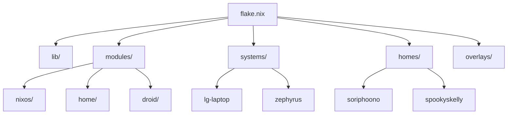

# Architecture Overview

This project is built on a modular Nix flake design, utilizing `flake-parts` to organize the configuration across multiple systems and environments.

## 🏗️ Design Principles

### Dynamic Discovery

The project uses a custom discovery library ([lib/default.nix](../lib/default.nix)) to automatically scan directories and construct configurations.

- **Systems**: Any folder in `systems/` with a `default.nix` is automatically added to `nixosConfigurations`.
- **Homes**: Standalone Home Manager profiles in `homes/` are discovered and built using `mkHome`.
- **Droids**: Nix-on-Droid configurations in `droids/` are automatically registered.

### Custom Builders

We use specialized builders to ensure consistency:

- `mkSystem`: Orchestrates NixOS systems, injecting core modules and system-specific metadata.
- `mkHome`: Manages standalone user environments, handling the overlay of "global" settings with specific user profiles.
- `mkDroid`: Standardizes Nix-on-Droid setups.

## 📂 Directory Structure

## ⚙️ Core Configuration (Modules)

Functional blocks are separated into `core`, `desktop`, and `hosting` categories within the NixOS modules, and `core` vs `userapps` in the Home modules. This allows systems to "mix and match" features by simply toggling options in their `default.nix`.
